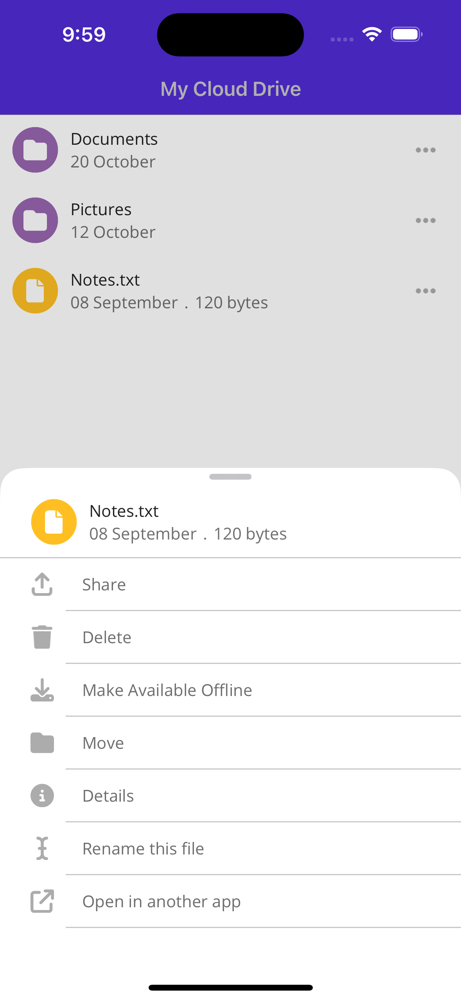

# MultiCommandCollectionView
This is a sample Maui app using `CollectionView` to execute multiple commands from the same row. I have built a little OneDrive clone to demonstrate the premise.

The data template binding for extra commands needs to use a `RelativeSource` binding, this is different to Xamarin where you could give the parent page an `x:Name` and reference it via an `x:Reference`:

```xml
<Button Command="{Binding MoreCommand, Source={RelativeSource AncestorType={x:Type viewmodels:MainViewModel}}}"/>
```

# Screenshots

Here is a demonstration of the navigation in the app:


### Landing Page


### Selecting A Folder


### Selecting A File


### Selecting More (...)


